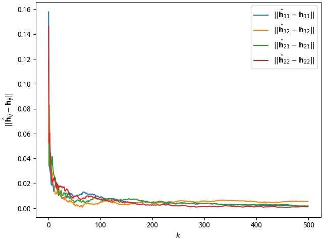

考虑数字移动通信系统的接收端采用双天线，接收来自两个发送端的等概率取值 $\pm1$
的 Bernoulli 序列信号 $x_{1n}$ 信和 $x_{2n}$ ，其中 $n$ 为符号周期序号。发送端
1 到接收端 2 根天线的多径子信道分别表达为

$$\begin{aligned}
  H_{11}(z) & = 0.6 - 0.2z^{-1} + 0.8z^{-3}\\
  H_{12}(z) & = -0.7 + 0.4z^{-1} - 0.5z^{-2}
\end{aligned}$$

而发送端 2 到接收端 2 根天线的多径子信道分别表达为

$$\begin{aligned}
  H_{21}(z) & = 0.38z^{-2} - 0.16z^{-3}\\
  H_{22}(z) & = 0.1 + 0.2z^{-1} + 0.2z^{-2} + 0.9z^{-3}
\end{aligned}$$

假设每根接收天线接收到的信号是来自两个发送端同步到达的信号以及噪声的线性叠加，
而且对应 2 根天线的噪声 $w_1(n)$ 和 $w_2(n)$ 是独立高斯白噪声，均值为 0，方差为
0.0121。

## 1

考虑从时刻 $n$ 至时刻 $n - L + 1$ 共计 $L$ 个符号周期，将接收数据顺序收集到一个
长度为 $2L$ 的接收数据矢量，其中每个时刻的 2 个样本在数据矢量中按天线 1 和天线
2 顺序排列，给出该接收数据矢量与输入信号之间关系的一般矢量表达式。

---

$$\begin{aligned}
  h_{11}(n) & = 0.6\delta(n) - 0.2\delta(n - 1) + 0.8\delta(n - 3)\\
  h_{12}(n) & = -0.7\delta(n) + 0.4\delta(n - 1) - 0.5\delta(n - 2)\\
  h_{21}(n) & = 0.38\delta(n - 2) - 0.16\delta(n - 3)\\
  h_{22}(n) & = 0.1\delta(n) + 0.2\delta(n - 2) + 0.9\delta(n - 3)\\
  y(2n - 1) & = x_1(n) * h_{11}(n) + x_2(n) * h_{21}(n) + w_1(n)\\
  & = 0.6x_1(n) - 0.2x_1(n - 1) + 0.8x_1(n - 3) + 0.38x_2(n - 2) -
  0.16x_2(n - 3) + w_1(n)\\
  y(2n) & = x_1(n) * h_{12}(n) + x_2(n) * h_{22}(n) + w_2(n)\\
  & = - 0.7x_1(n) + 0.4x_1(n - 1) - 0.5x_1(n - 2) + 0.1x_2(n) + 0.2x_2(n - 2) +
  0.9x_2(n - 3) + w_2(n)
\end{aligned}$$

## 2

发送端独立随机产生 $n = 1, 2, \ldots, N$ 个训练数据样本，基于最小二乘法
(Least-Squares, LS)，给出同时估计所有信道参数的估计表达式。设定 $N = 5000, L =
10$ ，将 $2N$ 个接收数据分割为 $K = N / L$ 个长度为 $2L$ 的无交叠矢量。蒙特卡洛
仿真给出，使用所有 $K$ 个矢量时的单次和独立 100 次的参数平均估计值，分别画图表
示，矢量个数顺序取不同值 $k = 1, 2, \ldots, K$ 对应的四个子信道各自平均估计误差。

---

$H_{ij}$ is a 3-order polynomial. So $\mathbf{h}_{ij}$ should be a 4-dim
vector. And input matrix $\mathbf{X}_i$ should be a $4 \times L$ matrix.

We have the following conditions:

$$\begin{aligned}
  \mathbf{h}_{11} & = \begin{bmatrix}
  0.6 & -0.2 & 0 & 0.8
  \end{bmatrix}^\mathsf{T}\\
  \mathbf{h}_{12} & = \begin{bmatrix}
  -0.7 & 0.4 & -0.5 & 0
  \end{bmatrix}^\mathsf{T}\\
  \mathbf{h}_{21} & = \begin{bmatrix}
  0 & 0 & 0.38 & -0.16
  \end{bmatrix}^\mathsf{T}\\
  \mathbf{h}_{22} & = \begin{bmatrix}
  0.1 & 0.2 & 0.2 & 0.9
  \end{bmatrix}^\mathsf{T}\\
  \mathbf{X}_i^\mathsf{T} & = \begin{bmatrix}
    x_i(n) & x_i(n - 1) & \cdots & x_i(n - 3)\\
    x_i(n - 1) & x_i(n - 2) & \cdots & x_i(n - 4)\\
    \vdots & \vdots & \ddots & \vdots\\
    x_i(n - 9) & x_i(n - 10) & \cdots & x_i(n - 12)
  \end{bmatrix}\\
  \mathbf{y}_j & = \begin{bmatrix}
  y_j(n) & y_j(n - 1) & \cdots & y_j(n - 9)\\
  \end{bmatrix}^\mathsf{T}
\end{aligned}$$

The system can be modeled as following:

$$\begin{aligned}
  \mathbf{y}_j & = \sum_{i = 1}^2\mathbf{X}_i^\mathsf{T}\mathbf{h}_{ij} +
  \mathbf{w}_j \rightarrow\\
  \begin{bmatrix}
  \mathbf{y}_1 & \mathbf{y}_2
  \end{bmatrix}
  & = \begin{bmatrix}
  \mathbf{X}^\mathsf{T}_1 & \mathbf{X}^\mathsf{T}_2
  \end{bmatrix}
  \begin{bmatrix}
  \mathbf{h}_{11} & \mathbf{h}_{12}\\
  \mathbf{h}_{21} & \mathbf{h}_{22}
  \end{bmatrix} +
  \begin{bmatrix}
  \mathbf{w}_1 & \mathbf{w}_2
  \end{bmatrix}\\
  \mathbf{Y} & = \mathbf{X}^\mathsf{T}\mathbf{H} + \mathbf{W}
\end{aligned}$$

The optimization target is as following:

$$\begin{aligned}
  \min_{\hat{\mathbf{H}}}
  & \mathbb{E}\lVert\hat{\mathbf{Y}} - \mathbf{Y}\rVert_\mathrm{F}\\
  \mathrm{s.t.}\quad\hat{\mathbf{Y}} & = \mathbf{X}^\mathsf{T}\hat{\mathbf{H}}
\end{aligned}$$

We know the general solution is:

$$\begin{aligned}
  \hat{\mathbf{H}} & = \mathbf{M}\mathbf{Y} +
  (\mathbb{I} - \mathbf{M}\mathbf{X}^\mathsf{T})\mathbf{Z}
\end{aligned}$$

Where, $\mathbf{M}$ is the 1, 3-inverse of $\mathbf{X}^\mathsf{T}$, that is
$\mathbf{M}$ statisfies the 1-st, 3-rd Moore-Penrose equation about
$\mathbf{X}^\mathsf{T}$^[You can find a proof in
[*this website*](https://blog.csdn.net/niu_123ming/article/details/104955706).].
And $\mathbf{Z}$ is the matrix which has same shape as $\mathbf{H}$.
$\mathbb{I}$ is eye matrix.

$$\begin{aligned}
  \mathbf{A}\mathbf{M}\mathbf{A} & = \mathbf{A}\\
  \mathbf{M}\mathbf{A}\mathbf{M} & = \mathbf{M}\\
  \mathbf{A}\mathbf{M} & \in \mathcal{O}\\
  \mathbf{M}\mathbf{A} & \in \mathcal{O}
\end{aligned}$$

Where $\mathcal{O}$ is the group comprised of all orthogonal matrices. If
$\mathbf{A}$ is a complex matrix, it should be unitary group $\mathcal{U}$. And
For convenience, we let:

$$\begin{aligned}
  \mathbf{A} & = \mathbf{X}^\mathsf{T}
\end{aligned}$$

We know if matrix $\mathbf{X}^\mathsf{T}$ is column-full-rank, the left inverse
${(\mathbf{X}^\mathsf{T})}^\mathsf{L}$ must exist, and belongs to the 1,
3-inverse. We can use the following equation to solve the question.

$$\begin{aligned}
  \hat{\mathbf{H}} & = {(\mathbf{X}^\mathsf{T})}^\mathsf{L}\mathbf{Y}\\
  & = {(\mathbf{X}\mathbf{X}^\mathsf{T})}^{-1}\mathbf{X}\mathbf{Y}
\end{aligned}$$

The results are as following. Where, $\hat{\mathbf{h}}_{ij;k}$ means the
estimation of the $k$-th Monte Carlo simulation and $\bar{\hat{\mathbf{h}}}_{ij;
k:l}$ means the average of estimations from the $k$-th Monte Carlo to the
$l$-th Monte Carlo.

$$\begin{aligned}
  \hat{\mathbf{h}}_{11;1} & = \begin{bmatrix}
    5.95208932 \times 10^{-1}& -2.00201138 \times 10^{-1}& 4.89423884 \times 10^{-3}& 8.06096258 \times 10^{-1}
  \end{bmatrix}^\mathsf{T}\\
  \hat{\mathbf{h}}_{12;1} & = \begin{bmatrix}
    -6.96733723 \times 10^{-1}& 4.01047198 \times 10^{-1}& -5.04871149 \times 10^{-1}& -1.40399346 \times 10^{-4}
  \end{bmatrix}^\mathsf{T}\\
  \hat{\mathbf{h}}_{21;1} & = \begin{bmatrix}
    6.78451673 \times 10^{-5}& 4.33064403 \times 10^{-3}& 3.71612773 \times 10^{-1}& -1.61483860 \times 10^{-1}
  \end{bmatrix}^\mathsf{T}\\
  \hat{\mathbf{h}}_{22;1} & = \begin{bmatrix}
    1.03954388 \times 10^{-1}& 1.92744957 \times 10^{-1}& 2.01545979 \times 10^{-1}& 9.01807509 \times 10^{-1}
  \end{bmatrix}^\mathsf{T}\\
  \bar{\hat{\mathbf{h}}}_{11;1:100} & = \begin{bmatrix}
    6.00546634 \times 10^{-1}& -1.99355598 \times 10^{-1}& 3.70599070 \times 10^{-4}& 7.99512773 \times 10^{-1}
  \end{bmatrix}^\mathsf{T}\\
  \bar{\hat{\mathbf{h}}}_{12;1:100} & = \begin{bmatrix}
    -7.00359942 \times 10^{-1}& 3.99140729 \times 10^{-1}& -5.00103699 \times 10^{-1}& 2.26105965 \times 10^{-4}
  \end{bmatrix}^\mathsf{T}\\
  \bar{\hat{\mathbf{h}}}_{21;1:100} & = \begin{bmatrix}
    -3.83029344 \times 10^{-4}& 4.14826953 \times 10^{-4}& 3.79450960 \times 10^{-1}& -1.60556772 \times 10^{-1}
  \end{bmatrix}^\mathsf{T}\\
  \bar{\hat{\mathbf{h}}}_{22;1:100} & = \begin{bmatrix}
    1.01326861 \times 10^{-1}& 1.99694608 \times 10^{-1}& 1.99148050 \times 10^{-1}& 9.00570456 \times 10^{-1}
  \end{bmatrix}^\mathsf{T}
\end{aligned}$$

The estimation error for $k = 1..K$ is presented as Fig. [errors](#errors).

{#errors}

## 3

基于所估计的信道参数，给出检测发射端 1 信号的线性最小均方误差(Minimum
MeanSquare-Error, MMSE)接收机表达式。设定 $N = 5000, L = 10$，蒙特卡洛仿真给出，
使用所有 $K$ 个矢量时的单次和独立 100 次的平均信干噪比(Signal to Interference
plus Noise Ratio, SINR) 值，并画图表示，矢量个数顺序取不同值 $k = 1, 2, \ldots,
K$ 对应的接收机输出的平均信干噪比。注意，请使用接收机输出信号中检测到的发射端 1
瞬时信号功率与瞬时干扰噪声功率之比进行 SINR 计算。

---

The MMSE receiver $\mathbf{f}_1$ is as following:

$$\begin{aligned}
  \arg\min_{\mathbf{f}_1}\mathbb{E}\lvert x_1 -
  \mathbf{f}_{11}^\mathsf{T}\mathbf{y}_1 -
  \mathbf{f}_{12}^\mathsf{T}\mathbf{y}_2\rvert^2
  & = \arg\min_{\mathbf{f}_1}\mathbb{E}\left|x_1 -
  \begin{bmatrix}
    \mathbf{f}_{11}^\mathsf{T} & \mathbf{f}_{12}^\mathsf{T}
  \end{bmatrix}
  \begin{bmatrix}
    \mathbf{y}_1\\
    \mathbf{y}_2
  \end{bmatrix}\right|\\
  & = \arg\min_{\mathbf{f}_1}\mathbb{E}\left|x_1 -
  \mathbf{f}_1^\mathsf{T}\mathbf{y}\right|\\
  & = \sigma^2_{x_1}\mathbf{R}_y^{-1}\mathbf{h}_1\\
  \mathbf{h}_1 & = \begin{bmatrix}
    \mathbf{h}_{11}\\
    \mathbf{h}_{12}
  \end{bmatrix}
\end{aligned}$$

The SINR of one simulation and the mean of SINR of 100 simulation are
respectively 0.6917 and 0.6924.

The SINR for $k = 1..K$ is presented as Fig. [sinr](#sinr).

## 4

类似 [2](#2) ， $N = 5000, L = 10$ ，改用噪声子空间分解法 (Subspace
Decomposition) ，给出同时估计所有信道参数的估计表达式；蒙特卡洛仿真给出，使用所
有 $K$ 个矢量时的单次和独立重复 100 次仿真的参数平均估计值。考虑到该方法只能给
出归一化的矢量，假设信道矢量在估计过程中的长度模糊因子已知，相位模糊因子以
$H_{11}(z)$ 最强幅度的那条径（+0.8）的符号进行相位校准，从而得出信道矢量的估计
值。

---

We have same conditions and symbol definitions as Question [2](#2). However, we
have different optimization target. Where, $\mathbf{U}_\mathrm{n}$ is noise
matrix, the row space of noise matrix $\mathbf{U}_\mathrm{n}$ is noise space.
We try to make $\mathbf{H}$ and $\mathbf{U}_\mathrm{n}$ are orthogonal. Where,
$\mathbf{\Sigma}_+$ is a full-rank matrix.

$$\begin{aligned}
  \min_{\mathbf{H}} & \left\Vert\mathbf{H}^\mathsf{T}\mathbf{U}_\mathrm{n}
  \right\Vert\\
  \mathrm{s.t.}\quad\mathbf{R}_\mathbf{x}
  & = \mathbf{U}\mathbf{\Sigma}\mathbf{U}^\mathsf{T}\\
  & = \mathbf{U}_\mathrm{s}\mathbf{\Sigma}_+\mathbf{U}_\mathrm{s}^\mathsf{T}\\
  \mathbf{U} & = \begin{bmatrix}
    \mathbf{U}_\mathrm{s} & \mathbf{U}_\mathrm{n}
  \end{bmatrix}
\end{aligned}$$

Same as Question [2](#2). The solution is as following. Where, $\mathbf{M}$ is
the 1-st, 3-rd inverse of $\mathbf{U}^\mathsf{T}_\mathrm{n}$.

$$\begin{aligned}
  \hat{\mathbf{H}} & = (\mathbb{I} -
  \mathbf{M}\mathbf{U}^\mathsf{T}_\mathrm{n})\mathbf{Z}
\end{aligned}$$

The results are as following. The symbol definition is same as Question [2](#2)
.

$$\begin{aligned}
  \hat{\mathbf{h}}_{11;1} & = \begin{bmatrix}
    6.00288026 \times 10^{-1}, -1.99587156 \times 10^{-1}, -1.41345409 \times 10^{-3}, 8.01311701 \times 10^{-1}
  \end{bmatrix}^\mathsf{T}\\
  \hat{\mathbf{h}}_{12;1} & = \begin{bmatrix}
    -6.99823475 \times 10^{-1}, 3.97898830 \times 10^{-1}, -5.02745758 \times 10^{-1}, 8.43365977 \times 10^{-4}
  \end{bmatrix}^\mathsf{T}\\
  \hat{\mathbf{h}}_{21;1} & = \begin{bmatrix}
    1.56208542 \times 10^{-4} & 3.44843128 \times 10^{-3} & 3.81341914 \times 10^{-1} & -1.58208931 \times 10^{-1}
  \end{bmatrix}^\mathsf{T}\\
  \hat{\mathbf{h}}_{22;1} & = \begin{bmatrix}
    9.90846610 \times 10^{-2} & 2.01448498 \times 10^{-1} & 2.01063657 \times 10^{-1} & 8.98689052 \times 10^{-1}
  \end{bmatrix}^\mathsf{T}\\
  \bar{\hat{\mathbf{h}}}_{11;1:100} & = \begin{bmatrix}
    6.00041071 \times 10^{-1} & -1.99944874 \times 10^{-1} & -2.85160915 \times 10^{-4} & 7.99909055 \times 10^{-1}
  \end{bmatrix}^\mathsf{T}\\
  \bar{\hat{\mathbf{h}}}_{12;1:100} & = \begin{bmatrix}
    -6.99861949 \times 10^{-1} & 3.99845253 \times 10^{-1} & -5.00115077 \times 10^{-1} & -4.08568209 \times 10^{-5}
  \end{bmatrix}^\mathsf{T}\\
  \bar{\hat{\mathbf{h}}}_{21;1:100} & = \begin{bmatrix}
    3.45951216 \times 10^{-4} & -1.58673709 \times 10^{-4} & 3.79854136 \times 10^{-1} & -1.59683451 \times 10^{-1}
  \end{bmatrix}^\mathsf{T}\\
  \bar{\hat{\mathbf{h}}}_{22;1:100} & = \begin{bmatrix}
    1.00108508 \times 10^{-1} & 2.00007279 \times 10^{-1} & 1.99927241 \times 10^{-1} & 9.00013455 \times 10^{-1}
  \end{bmatrix}^\mathsf{T}
\end{aligned}$$

## 5

同时提交以上的 Matlab 仿真源代码 m 文件电子版。
