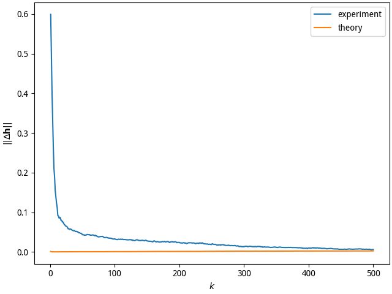
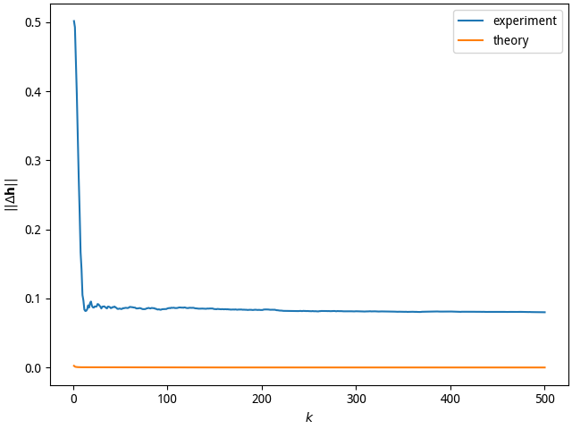

假设在问题 1 中只有发送端 1 发送信号，而发送端 2 处于待机状态。设定
$N = 5000, L = 10$，给定 $K = N / L$ 个长度为 2L 的无交叠接收数据矢量。基于这些
数据，使用噪声子空间分解法估计从发送端 1 到接收端 2 根天线的信道参数。分析推导
信道估计的误差表达式，代入数值得出对应 $k = 1, 2, \ldots, K$ 的理论预计误差数值，
并与仿真 100 次对应不同 k 值的平均值进行比较，分析产生预测误差的原因，讨论有无
减小误差的方法。

---

## Model

We have the following conditions:

$$\begin{aligned}
  \mathbf{h}_{11} & = \begin{bmatrix}
  0.6 & -0.2 & 0 & 0.8
  \end{bmatrix}^\mathsf{T}\\
  \mathbf{h}_{12} & = \begin{bmatrix}
  -0.7 & 0.4 & -0.5 & 0
  \end{bmatrix}^\mathsf{T}\\
  \mathbf{h}_{21} & = \begin{bmatrix}
  0 & 0 & 0.38 & -0.16
  \end{bmatrix}^\mathsf{T}\\
  \mathbf{h}_{22} & = \begin{bmatrix}
  0.1 & 0.2 & 0.2 & 0.9
  \end{bmatrix}^\mathsf{T}\\
  \mathbf{h}_{ij} & = \begin{bmatrix}
  h_{ij1} & h_{ij2} & h_{ij3} & h_{ij4}
  \end{bmatrix}^\mathsf{T}\\
  \mathbf{x}_1 & = \begin{bmatrix}
  x_1(n) & x_1(n - 1) & \cdots & x_1(n - 9)\\
  \end{bmatrix}^\mathsf{T}\\
  \mathbf{x}_2 & = \mathbf{0}\\
  \mathbf{y}_j & = \begin{bmatrix}
  y_j(n) & y_j(n - 1) & \cdots & y_j(n - 9)\\
  \end{bmatrix}^\mathsf{T}\\
  \mathbf{h} & = \begin{bmatrix}
  \mathbf{h}_{11}\\
  \mathbf{h}_{12}
  \end{bmatrix} \in \mathbb{R}^{8 \times 1}\\
  \mathbf{H}_{ij} & = \begin{bmatrix}
    h_{ij1} & h_{ij2} & h_{ij3} & h_{ij4} & 0 & 0 & \cdots & 0\\
    0 & h_{ij1} & h_{ij2} & h_{ij3} & h_{ij4} & 0 & \cdots & 0\\
    \vdots & \ddots & \ddots & \ddots & \ddots & \ddots & \ddots & \vdots\\
    0 & 0 & \cdots & \cdots & \cdots & \cdots & 0 & h_{ij1}
  \end{bmatrix} \in \mathbb{R}^{10 \times 10}
\end{aligned}$$

The system can be modeled as following:

$$\begin{aligned}
  \mathbf{y}_j & = \sum_{i = 1}^2\mathbf{H}_{ij}\mathbf{x}_i + \mathbf{w}_j\\
  \begin{bmatrix}
    \mathbf{y}_1\\
    \mathbf{y}_2
  \end{bmatrix}
   & =
  \begin{bmatrix}
   \mathbf{H}_{11}\\
   \mathbf{H}_{12}
  \end{bmatrix}
  \mathbf{x}_1 +
  \begin{bmatrix}
    \mathbf{w}_1\\
    \mathbf{w}_2
  \end{bmatrix}\\
  \mathbf{y} & = \mathbf{H}\mathbf{x} + \mathbf{w}\\
  \mathbf{y} & \in \mathbb{R}^{20 \times 1}\\
  \mathbf{x} & \in \mathbb{R}^{10 \times 1}\\
  \mathbf{H} & \in \mathbb{R}^{20 \times 10}
\end{aligned}$$

## Solution

In order to solve the problem, Let us do eigen value decomposition:

$$\begin{aligned}
  \mathbf{R}_\mathbf{y} & = \mathbf{U}\mathbf{\Sigma}\mathbf{U}^\mathsf{H}\\
  \mathbf{U} & =
  \begin{bmatrix}
    \mathbf{U}_\mathrm{n} & \mathbf{U}_\mathrm{s}
  \end{bmatrix}\\
  \mathbf{U}_\mathrm{n} & =
  \begin{bmatrix}
    \mathbf{u}_1 & \mathbf{u}_2 & \cdots & \mathbf{u}_k\\
  \end{bmatrix}
\end{aligned}$$

Where, $k$ is the number of noise vectors. The eigen values are sorted
increasingly. We have two methods to get $k$:

1. If we know the noise variance, We can assume all $\mathbf{u}_k$ whose
   $\sigma_k < \sigma_\mathrm{n}$ are noise vectors.
2. we just let $k = 20 - 10$, because we have
  $\mathbf{y} \in \mathbb{R}^{20 \times 1}$ and
  $\mathbf{x} \in \mathbb{R}^{10 \times 1}$.

We can use attribution of toeplitz matrix:

$$\begin{aligned}
  \mathbf{u}_i^\mathsf{H}\mathbf{H}
  & = \mathbf{h}^\mathsf{H}\mathbf{U}_i\\
  \mathbf{u}_i & = \begin{bmatrix}
    u_{i1} & u_{i2} & \cdots & u_{i(20)}\\
  \end{bmatrix}^\mathsf{T} \in \mathbb{R}^{20 \times 1}\\
  \mathbf{U}_i & = \begin{bmatrix}
    u_{i1} & u_{i2} & \cdots & u_{i9} & u_{i(10)}\\
    0 & u_{i1} & u_{i2} & \cdots & u_{i9}\\
    \vdots & \ddots & \ddots & \ddots & \vdots\\
    0 & 0 & \cdots & u_{i6} & u_{i7}\\
    u_{i(11)} & u_{i(12)} & \cdots & u_{i(19)} & u_{i(20)}\\
    0 & u_{i(11)} & u_{i(12)} & \cdots & u_{i(19)}\\
    \vdots & \ddots & \ddots & \ddots & \vdots\\
    0 & 0 & \cdots & u_{i(16)} & u_{i(17)}
  \end{bmatrix}\in \mathbb{R}^{8 \times 10}\\
\end{aligned}$$

The optimization target is [@1045288].

$$\begin{aligned}
  \min_\mathbf{h}\left\Vert\mathbf{U}_\mathrm{n}^\mathsf{H}\mathbf{H}
  \right\Vert & = \min_\mathbf{h}\left\Vert\sum_{i = 1}^k
  \mathbf{u}_i^\mathsf{H}\mathbf{H}\right\Vert\\
  & = \min_\mathbf{h}\left\Vert\sum_{i = 1}^k\mathbf{h}^\mathsf{H}
  \mathbf{U}_i\right\Vert\\
  & = \min_\mathbf{h}\left\Vert\mathbf{h}^\mathsf{H}\mathbf{G}\right\Vert\\
  \mathbf{G} & = \begin{bmatrix}
  \mathbf{U}_1 & \mathbf{U}_2 & \cdots & \mathbf{U}_k
  \end{bmatrix} \in \mathbb{R}^{8 \times 10k}
\end{aligned}$$

We notice it statify Rayleigh Quotient theorem. Where *eigv* means the
eigen vectors sorted increasingly by corresponding eigen value.

$$\begin{aligned}
  \arg\min_{\mathbf{\tilde{h}}}\left\Vert\mathbf{\tilde{h}}^\mathsf{H}\mathbf{G}\right\Vert
  & = \arg\min_\mathbf{\tilde{h}}\mathbf{\tilde{h}}^\mathsf{H}\mathbf{G}
  \mathbf{G}^\mathsf{H}\mathbf{\tilde{h}}\\
  & = \mathbf{eigv}_1^\uparrow(\mathbf{G}\mathbf{G}^\mathsf{H})\\
  \tilde{\mathbf{h}} & = \frac{\mathbf{h}}{\lVert\mathbf{h}\rVert}
\end{aligned}$$

## Error Analysis

$$\begin{aligned}
  \Delta\tilde{\mathbf{h}} & = \mathbf{G}^+\begin{bmatrix}
  \mathbf{H}^\mathsf{H}\mathbf{X}^+\mathbf{N}^\mathsf{H}
  \mathbf{u}_1\\
  \mathbf{H}^\mathsf{H}\mathbf{X}^+\mathbf{N}^\mathsf{H}
  \mathbf{u}_2\\
  \vdots\\
  \mathbf{H}^\mathsf{H}\mathbf{X}^+\mathbf{N}^\mathsf{H}
  \mathbf{u}_{\mathrm{n}_k}
  \end{bmatrix}\\
  & = \mathbf{G}^+\begin{bmatrix}
    \mathbf{H}^\mathsf{H}\mathbf{X}^+ & & \\
    & \ddots & \\
    & & \mathbf{H}^\mathsf{H}\mathbf{X}^+
  \end{bmatrix}
  \begin{bmatrix}
    \mathbf{N}^\mathsf{H}\mathbf{u}_1\\
    \mathbf{N}^\mathsf{H}\mathbf{u}_2\\
    \vdots\\
    \mathbf{N}^\mathsf{H}\mathbf{u}_{\mathrm{n}_k}
  \end{bmatrix}\\
  & = \mathbf{G}^+\mathbf{B}\mathbf{d}
\end{aligned}$$

Where, $\mathbf{N}$ is noise perturbation.

$$\begin{aligned}
  \mathbb{E}\mathbf{N}^\mathsf{H}\mathbf{u}_i
  \mathbf{u}_i^\mathsf{H}\mathbf{N} & =
  \sigma^2_\mathrm{n}\mathrm{tr}(\mathbf{u}_i\mathbf{u}_i^\mathsf{H})\mathbb{I}\\
  & = \sigma^2_\mathrm{n}\delta(i - j)\mathbb{I}
\end{aligned}$$

$$\begin{aligned}
  \mathbb{E}\mathbf{d}\mathbf{d}^\mathsf{H} & = \sigma^2_\mathrm{n}\mathbb{I}
\end{aligned}$$

So the theoretical estimation error is[@1045288].

$$\begin{aligned}
  \mathbb{E}{\lVert\Delta\tilde{\mathbf{h}}\rVert}^2 & = \mathbb{E}\mathrm{tr}
  \Delta\tilde{\mathbf{h}}\Delta\tilde{\mathbf{h}}^\mathsf{H}\\
  & = \mathrm{tr}\mathbb{E}\mathbf{G}^+\mathbf{B}\mathbf{d}
  \mathbf{d}^\mathsf{H}\mathbf{B}^\mathsf{H}\mathbf{G}^\mathsf{+H}\\
  & = \mathrm{tr}\mathbf{G}^+\mathbf{B}\mathbb{E}(\mathbf{d}
  \mathbf{d}^\mathsf{H})\mathbf{B}^\mathsf{H}\mathbf{G}^{+\mathsf{H}}\\
  & = \sigma^2_\mathrm{n}\mathrm{tr}\mathbf{G}^+\mathbf{B}
  \mathbf{B}^\mathsf{H}\mathbf{G}^{+\mathsf{H}}\\
  & \approx \sigma^2_\mathrm{n}\mathrm{tr}(\mathbf{G}^+
  \mathbf{G}^{+\mathsf{H}})\hat{\mathbf{R}}_\mathrm{s}^{-1}\\
  & = \frac{1}{N_\mathrm{b}}\sigma^2_\mathrm{n}\mathrm{tr}(\mathbf{G}^+
  \mathbf{G}^{+\mathsf{H}})\mathbf{R}_\mathrm{s}^{-1}\\
  & = \frac{1}{N_\mathrm{b}\sigma_\mathrm{s}^2}\sigma^2_\mathrm{n}\mathrm{tr}(\mathbf{G}^+
  \mathbf{G}^{+\mathsf{H}})\\
  & = \frac{\sigma^2_\mathrm{n}\lVert\mathbf{G}^+\rVert^2}
  {\sigma^2_\mathrm{s}N_\mathrm{b}}
\end{aligned}$$

$N_\mathrm{b}$ is the sample times to calculate $\mathbf{R}_\mathbf{y}$.

$$\begin{aligned}
  \lim_{N_\mathrm{b} \rightarrow \infty}\frac{1}{N_\mathrm{b}}
  \sum_{i = 1}^{N_\mathrm{b}}\mathbf{y}_i\mathbf{y}_i^\mathsf{H} & = \mathbf{R}_\mathbf{y}
\end{aligned}$$

## Experiment

If we use the first method to get $k$, the mean of estimation errors of 100
simulations is as Fig [simo](#simo).

{#simo height=6cm}

The second method's result is as Fig [simo2](#simo2).

{#simo2 height=6cm}

Obviously, if we know the noise variance $\sigma_\mathrm{n}$, the estimation
can be more accurate.

When the number is tend to infinity, the estimation will be more accurate.
Because the theoretical error is just only an approximation.

$$\begin{aligned}
  \mathbb{E}{\lVert\Delta\tilde{\mathbf{h}}\rVert}^2 & \approx
  \frac{\sigma^2_\mathrm{n}\lVert\mathbf{G}^+\rVert^2}
  {\sigma^2_\mathrm{s}N_\mathrm{b}}
\end{aligned}$$

## Program Usage

Note, only in Unix, you can input `./simo.py` as an abbreviation. In Windows
you must input `python simo.py`.

```shell
$ ./simo.py --help
A simulation program of SIMO.

usage: simo.py [-hV] [-s <seed>] [-t <times>] [-k <vectors>] [-l <length>]
    [-a <name>] [-v <var>] [-N <noise>] [-n] [-S]

options:
    -h, --help              Show this screen.
    -V, --version           Show version.
    -s, --seed <seed>       Random seed. [default: 42]
    -t, --times <times>     Times of Monte Carlo simulations. [default: 100]
    -k, --vector <vector>   Number of vectors. [default: 500]
    -l, --length <length>   Length of a vector. [default: 10]
    -a, --name <name>       Name of figure. [default: simo]
    -v, --var <var>         Variance of noise. [default: 0.0121]
    -N, --noise <noise>     Number of noises. 0 means auto. [default: 0]
    -n, --dry-run           Don't open display window.
    -S, --save              Save the figure.
$ ./simo.py -t10 -k25
Global seed set to 42
Monte Carlo simulation:  30%|++++++++++                  | 3/10 [00:04<00:10,  1.44s/it]
Use k input vectors:  48%|++++++++++++++++              | 12/25 [00:00<00:00, 95.90it/s]
```
