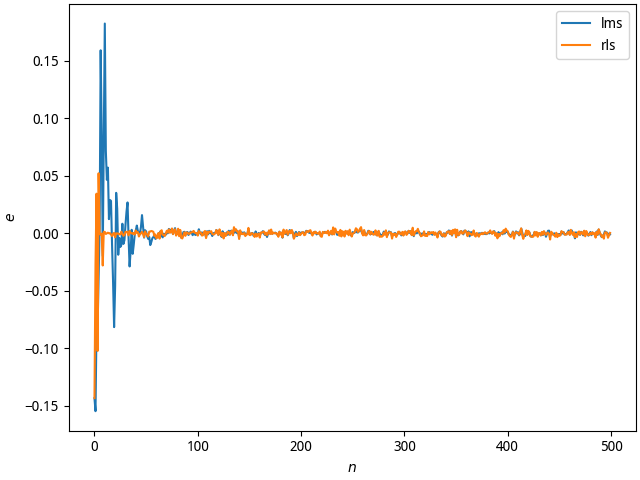
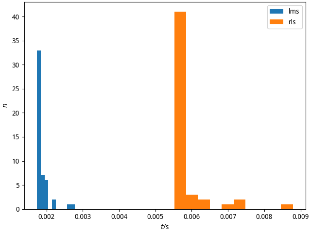

考虑一个系统，在时刻 $n$ 的输入信号 $x(n)$, 系统冲击响应 $h(n)$、噪声 $v(n)$ 和
输出信号 $u(n)$ 满足以下关系

$$\begin{aligned}
  u(n) & = \sum_{k = 1}^2h(k)x(n - k) + v(n)
\end{aligned}$$

其中，输入信号为等概率取值 $\pm 1$ 的 Bernoulli 序列信号，噪声是高斯白噪声，均
值为 0，方差为 0.01。用于估计输入信号的接收机长度设为 $M = 6$ ，对应时刻 $n$ 至
$n - 5$ 的 $M$ 个输出信号置于一个列矢量
$\mathbf{u}_n = [u(n), u(n-1), \ldots, u(n-5)]^\mathsf{T}$. 类似地，对其有贡献
的输入信号置于矢量 $\mathbf{x}_n = [x(n-1), x(n-2), \cdots, x(n-7)]^\mathsf{T}$
，噪声置于矢量 $\mathbf{v}_n$. 它们满足以下关系

$$\begin{aligned}
  \mathbf{u}_n & = \mathbf{H}\mathbf{x}_n + \mathbf{v}_n
\end{aligned}$$

假设 $h(1) = 0.6, h(2) = -0.2$。时刻 $n = 1, 2, \ldots, 500$ 的输入信号和噪声均
独立随机产生。

## 1

根据 $\mathbf{u}_n$ 的自相关矩阵 $\mathbf{R}$ 以及 $\mathbf{u}_n$ 与 $x(n - 2)$
的互相关矢量，计算理想的最小均方误差 (Minimum-Mean-Square-Error，MMSE)接收机的
$M$ 个系数值。

---

$$\begin{aligned}
  \mathbf{f}_\mathrm{MMSE} & = \sigma^2_x\mathbf{R}^{-1}\mathbf{h}_1\\
  \sigma^2_x & = 1\\
  \mathbf{R} & = \mathbf{H}\mathbf{R}_\mathbf{x}\mathbf{H}^\mathsf{H} +
  \mathbf{R}_\mathbf{v}\\
  \mathbf{R}_\mathbf{v} & = \sigma^2_\mathbf{v}\mathbb{I}\\
  \mathbf{H} & =
  \begin{bmatrix}
    0.6 & 0.7 & 0 & \cdots & 0\\
    0 & 0.6 & 0.7 & \cdots & 0\\
    \vdots & \ddots & \ddots & \ddots & \vdots\\
    0 & \cdots & 0 & 0.6 & 0.7
  \end{bmatrix}\\
  \mathbf{h}_1 & = \mathbf{H}_{:1}\\
  \mathbf{R}_\mathbf{x} & = \mathbb{I}\\
  \mathbf{f}_\mathrm{MMSE} & =
  \begin{bmatrix}
    1.11778385 & -0.86022408 & 0.64362736 & -0.45767956 & 0.29352602 & -0.14334992
  \end{bmatrix}^\mathsf{T}
\end{aligned}$$

## 2

使用最小均方法(Least-Mean-Square, LMS)，接收机初始化采用零矢量，按序
$n = 1, 2, \ldots, 500$ 迭代接收机的 $M$ 个系数，迭代步长选为 $0.1/\max\lambda$
，其中 $\max\lambda$ 是矩阵 $\mathbf{R}$ 的最大特征值。独立重复此迭代过程50次，
每次输入信号和噪声均是独立随机生成。给出在时刻 $n=500$ 时迭代50次进行平均后的
$M$ 个系数。

---

$$\begin{aligned}
  \hat{\mathbf{h}} & =
  \begin{bmatrix}
    0.60036351 & 0.69978597
  \end{bmatrix}
\end{aligned}$$

## 3

使用递推最小二乘法(Recursive Least-Squares, RLS)，选取算法正则化参数
$\delta = 0.005$ 和零矢量进行算法初始化。给出在时刻 $n = 500$ 时迭代 50 次进行
平均后的 $M$ 个系数。

---

$$\begin{aligned}
  \hat{\mathbf{h}} & =
  \begin{bmatrix}
    0.60212175 & 0.69964705
  \end{bmatrix}
\end{aligned}$$

## 4

比较上述 LMS 算法和 RLS 算法的性能结果，并分析各自的优缺点。

---

{height=5cm}

{height=5cm}

## 5

提交报告与程序源代码。
